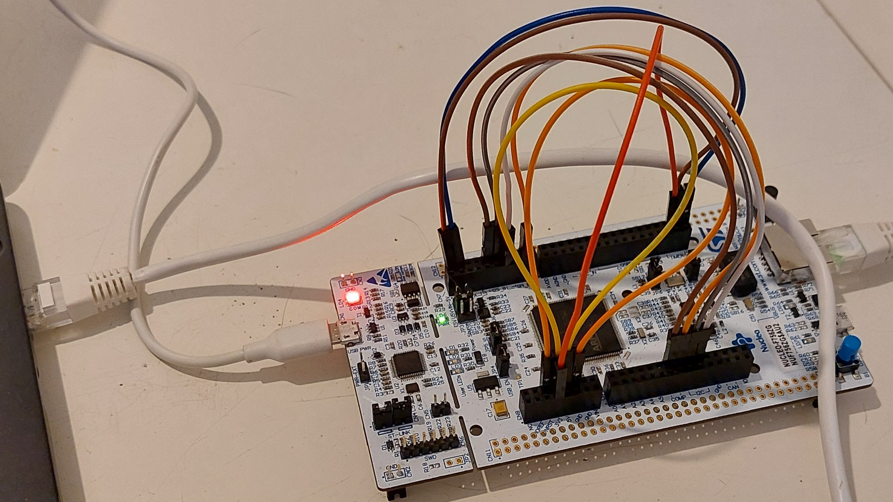
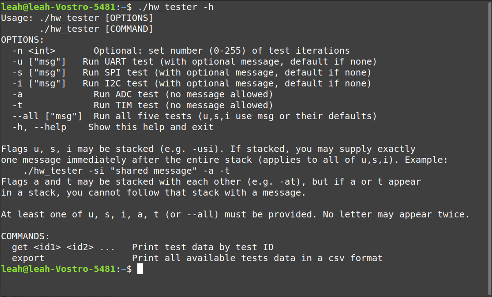
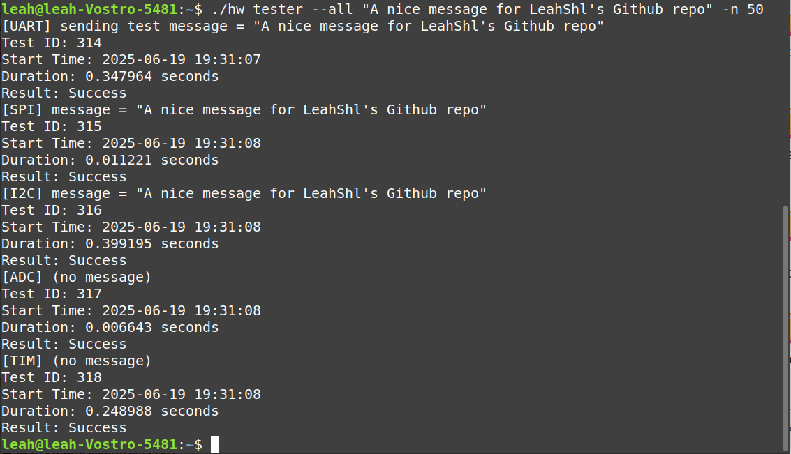
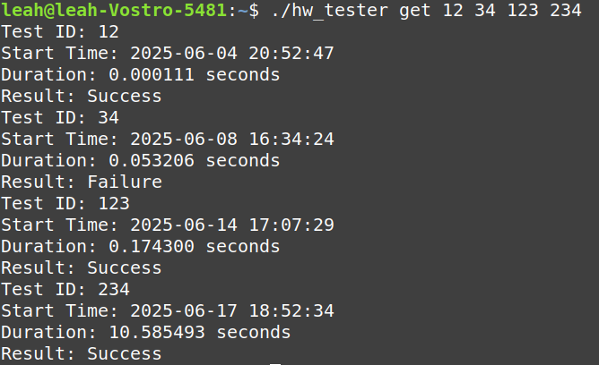
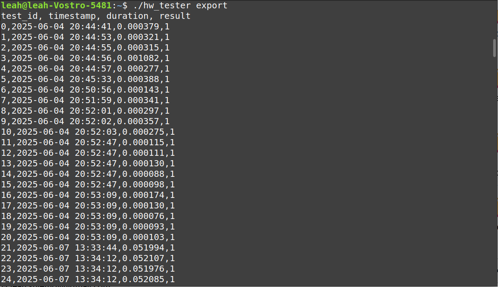

# Thư viện Ảnh
Dự án thuộc quyền sở hữu của **Phạm Lê Ngọc Sơn**.

## Thiết lập phần cứng
Bo được nối trực tiếp với PC qua Ethernet và qua USB bằng cổng ST-Link. GPIO được đấu như hướng dẫn [tại đây](https://github.com/LeahShl/STM32F756ZG_HW_Verification/blob/main/README.md#4-setup-hardware).

## Ví dụ đầu ra CLI
### Hiển thị trợ giúp với `-h`/`--help`

### Chạy toàn bộ test với `--all`

### In thông tin test cụ thể bằng `get`

Thông tin bên lề về các bài test:
 - Test 12 được thực hiện trước khi viết code STM32 nên dùng server giả; server giả luôn trả PASS và thời gian phản hồi rất nhanh.
 - Test 23 chạy trong lúc phát triển và fail vì nguyên nhân không liên quan phần cứng.
 - Test 123 chạy khi đang phát triển; pass nhưng chậm do log debug.
 - Test 234 chạy khi gắn debugger; thời gian phản hồi dài vì dừng ở breakpoint.

### Xuất cơ sở dữ liệu CSV với `export`
Chỉ hiển thị vài dòng đầu. Có thể chuyển hướng ra file, ví dụ `./hw_tester export > test_results.csv`.

